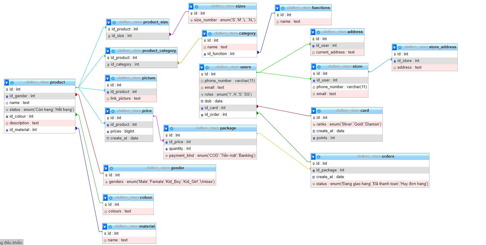

# Đồ án Database

**Table**
```sql
CREATE TABLE gender(
	id INT PRIMARY KEY AUTO_INCREMENT,
	genders ENUM ('Male','Female','Kid_Boy','Kid_Girl','Unisex')
)

CREATE TABLE colour (
	id INT PRIMARY KEY AUTO_INCREMENT,
	colours TEXT NOT NULL
)

CREATE TABLE material(
	id INT PRIMARY KEY AUTO_INCREMENT,
	name TEXT NOT NULL
)

CREATE TABLE picture(
	id INT PRIMARY KEY AUTO_INCREMENT,
	id_product INT,
	link_picture TEXT NOT NULL,
	FOREIGN KEY(id_product) REFERENCES product (id)
)

CREATE TABLE functions (
	id INT PRIMARY KEY AUTO_INCREMENT,
	name TEXT NOT NULL
)

CREATE TABLE product_size(
	id_product INT,
	id_size INT,
	PRIMARY KEY(id_product,id_size),
	FOREIGN KEY(id_product) REFERENCES product(id),
	FOREIGN KEY(id_size) REFERENCES sizes (id)
)

CREATE TABLE price(
	id INT PRIMARY KEY AUTO_INCREMENT,
	id_product INT,
	prices BIGINT NOT NULL,
	create_at DATE NOT NULL,
	FOREIGN KEY(id_product) REFERENCES product(id)
)

CREATE TABLE package (
	id INT PRIMARY KEY AUTO_INCREMENT,
	id_price INT,
	quantity INT NOT NULL,
	payment_kind ENUM ('COD','Tiền mặt','Banking'),
	FOREIGN KEY (id_price) REFERENCES price (id)
)

CREATE TABLE orders (
	id INT PRIMARY KEY AUTO_INCREMENT,
	id_package INT,
	create_at DATE NOT NULL,
	status ENUM('Đang giao hang','Đã thanh toán','Huy đơn hang')
)

CREATE TABLE product_category (
	id_product INT,
	id_category INT,
	PRIMARY KEY(id_product,id_category),
	FOREIGN KEY(id_product) REFERENCES product(id),
	FOREIGN KEY(id_category) REFERENCES category (id)
)

CREATE TABLE product(
	id INT PRIMARY KEY AUTO_INCREMENT,
	id_gender INT,
	name TEXT NOT NULL,
	status ENUM ('Còn hang','Hết hang') NOT NULL,
	id_colour INT,
	description TEXT NOT NULL,
	id_material INT,
	FOREIGN KEY(id_gender) REFERENCES gender (id),
	FOREIGN KEY(id_colour) REFERENCES colour (id),
	FOREIGN KEY(id_material) REFERENCES material (id)
)

CREATE TABLE orders(
	id INT PRIMARY KEY AUTO_INCREMENT,
	id_package INT,
	create_at DATE NOT NULL,
	status ENUM('Đang giao hang','Đã thanh toan','Huy đơn hang') NOT NULL,
	FOREIGN KEY(id_package) REFERENCES package(id)
)

CREATE TABLE users(
	id INT PRIMARY KEY AUTO_INCREMENT,
	phone_number VARCHAR (11) NOT NULL,
	email TEXT NOT NULL,
	roles ENUM('1','A','S','SS') NOT NULL,
	dob DATE NOT NULL,
	id_card INT,
	id_order INT,
	FOREIGN KEY(id_card) REFERENCES card (id),
	FOREIGN KEY(id_order) REFERENCES orders (id)
)

CREATE TABLE card(
	id INT PRIMARY KEY AUTO_INCREMENT,
	ranks ENUM ('Sliver','Gold','Diamon') NOT NULL,
	create_at DATE NOT NULL,
	points INT NOT NULL
)

CREATE TABLE address(
	id INT PRIMARY KEY AUTO_INCREMENT,
	id_user INT,
	current_address TEXT NOT NULL,
	FOREIGN KEY(id_user) REFERENCES users (id)
)

CREATE TABLE store(
	id INT PRIMARY KEY AUTO_INCREMENT,
	id_user INT,
	phone_number VARCHAR(11) NOT NULL,
	email TEXT NOT NULL,
	FOREIGN KEY(id_user) REFERENCES users (id)
)

CREATE TABLE store_address(
	id INT PRIMARY KEY AUTO_INCREMENT,
	id_store INT,
	address TEXT NOT NULL,
	FOREIGN KEY(id_store) REFERENCES store (id)
)

CREATE TABLE product_category(
	id_product INT,
	id_category INT,
	PRIMARY KEY (id_product,id_category),
	FOREIGN KEY(id_product) REFERENCES product (id),
	FOREIGN KEY(id_category) REFERENCES category (id)
)
```

**DATA**
```sql
INSERT INTO gender (id,genders) VALUES(1,'Male'),(2,'Female'),(3,'Kid_Boy'),(4,'Kid_Girl'),(5,'Unisex')
INSERT INTO colour (id,colours) VALUES (1,'Red'),(2,'Blue'),(3,'Black'),(4,'Green'),(5,'Yellow'),(6,'White'),(7,'Gray')


insert into users (id, phone_number, email, roles, dob, id_card) values (null, '860-218-524', 'gslide0@nba.com', 1, '2020-12-14', 1);
insert into users (id, phone_number, email, roles, dob, id_card) values (null, '334-542-892', 'wgummoe1@desdev.cn','A', '2021-12-04', 2);
insert into users (id, phone_number, email, roles, dob, id_card) values (null, '994-286-745', 'rtilney2@youtu.be', 'S', '2019-05-20', 3);
insert into users (id, phone_number, email, roles, dob, id_card) values (null, '757-694-072', 'meich3@webnode.com', 'A', '2016-12-28', 4);
insert into users (id, phone_number, email, roles, dob, id_card) values (null, '744-366-263', 'dlorking4@ifeng.com', 'S', '2019-04-20', 5);
insert into users (id, phone_number, email, roles, dob, id_card) values (null, '593-179-346', 'mcalder5@artisteer.com', 'S', '2017-01-11', 6);
insert into users (id, phone_number, email, roles, dob, id_card) values (null, '717-154-426', 'jwynter6@altervista.org', 'A', '2019-03-19', 7);
insert into users (id, phone_number, email, roles, dob, id_card) values (null, '707-234-973', 'lnorthgraves7@kickstarter.com', 'A', '2020-12-08', 8);
insert into users (id, phone_number, email, roles, dob, id_card) values (null, '655-941-120', 'cmanthorpe8@npr.org', 'S', '2020-01-27', 9);
insert into users (id, phone_number, email, roles, dob, id_card) values (null, '836-588-996', 'cbeaglehole9@accuweather.com', 'A', '2020-07-06', 10);
insert into users (id, phone_number, email, roles, dob, id_card) values (null, '660-332-491', 'cpauluzzia@ask.com', 'S', '2016-10-18', 11);
insert into users (id, phone_number, email, roles, dob, id_card) values (null, '806-547-960', 'scoalesb@list-manage.com', 'S', '2021-02-22', 12);
insert into users (id, phone_number, email, roles, dob, id_card) values (null, '411-596-133', 'ckirkamc@census.gov', 'A', '2018-11-30', 13);
insert into users (id, phone_number, email, roles, dob, id_card) values (null, '245-758-446', 'pcushed@marriott.com', 'A', '2017-06-29', 14);
insert into users (id, phone_number, email, roles, dob, id_card) values (null, '955-151-026', 'ckilbeye@seattletimes.com', 'SS', '2018-09-13', 15);
insert into users (id, phone_number, email, roles, dob, id_card) values (null, '781-632-670', 'hmacshirief@nba.com', 'A', '2021-03-06', 16);
insert into users (id, phone_number, email, roles, dob, id_card) values (null, '901-835-600', 'hstathamg@paypal.com', 'S', '2020-09-19', 17);
insert into users (id, phone_number, email, roles, dob, id_card) values (null, '542-598-412', 'mvannahh@topsy.com','A', '2016-09-08', 18);
insert into users (id, phone_number, email, roles, dob, id_card) values (null, '450-683-344', 'hgillinghami@huffingtonpost.com', 'A', '2020-02-01', 19);
insert into users (id, phone_number, email, roles, dob, id_card) values (null, '517-883-346', 'abellj@bizjournals.com', '1', '2012-10-14', 99);
insert into users (id, phone_number, email, roles, dob, id_card) values (null, '517-883-246', 'abellj@bizjournals.com', '1', '2013-10-14', 98);
insert into users (id, phone_number, email, roles, dob, id_card) values (null, '517-883-146', 'abellj@bizjournals.com', '1', '2000-10-14', 97);


insert into card (id, ranks, create_at, points) values (null, 'Diamon', '2021-07-04', 380);
insert into card (id, ranks, create_at, points) values (null, 'Sliver', '2021-04-12', 58);
insert into card (id, ranks, create_at, points) values (null, 'Gold', '2021-09-20', 242);
insert into card (id, ranks, create_at, points) values (null, 'Sliver', '2022-02-08', 54);
insert into card (id, ranks, create_at, points) values (null, 'Gold', '2021-03-07', 127);
insert into card (id, ranks, create_at, points) values (null, 'Sliver', '2021-08-28', 60);
insert into card (id, ranks, create_at, points) values (null, 'Diamon', '2021-06-15', 381);
insert into card (id, ranks, create_at, points) values (null, 'Sliver', '2021-12-22', 89);
insert into card (id, ranks, create_at, points) values (null, 'Gold', '2021-05-29', 116);
insert into card (id, ranks, create_at, points) values (null, 'Gold', '2021-10-04', 122);
insert into card (id, ranks, create_at, points) values (null, 'Gold', '2022-01-11', 187);
insert into card (id, ranks, create_at, points) values (null, 'Sliver', '2021-03-25', 31);
insert into card (id, ranks, create_at, points) values (null, 'Gold', '2021-10-01', 106);
insert into card (id, ranks, create_at, points) values (null, 'Gold', '2021-08-06', 188);
insert into card (id, ranks, create_at, points) values (null, 'Sliver', '2022-01-23', 60);
insert into card (id, ranks, create_at, points) values (null, 'Gold', '2022-01-24', 167);
insert into card (id, ranks, create_at, points) values (null, 'Sliver', '2021-10-27', 47);
insert into card (id, ranks, create_at, points) values (null, 'Sliver', '2022-01-21', 67);
insert into card (id, ranks, create_at, points) values (null, 'Gold', '2021-08-31', 234);
insert into card (id, ranks, create_at, points) values (null, 'Sliver', '2022-02-15', 31);
insert into card (id, ranks, create_at, points) values (97, 'Sliver', '2022-02-15', 0);
insert into card (id, ranks, create_at, points) values (98, 'Sliver', '2022-02-15', 0);
insert into card (id, ranks, create_at, points) values (99, 'Sliver', '2022-02-15', 0);

insert into address (id, id_user, current_address) values (null, 1, '5 Macpherson Plaza');
insert into address (id, id_user, current_address) values (null, 2, '69 Dayton Center');
insert into address (id, id_user, current_address) values (null, 3, '4 Columbus Place');
insert into address (id, id_user, current_address) values (null, 4, '58477 Loeprich Point');
insert into address (id, id_user, current_address) values (null, 5, '3 Reindahl Park');
insert into address (id, id_user, current_address) values (null, 6, '41 Brickson Park Parkway');
insert into address (id, id_user, current_address) values (null, 7, '8 Vahlen Court');
insert into address (id, id_user, current_address) values (null, 8, '1402 Buell Circle');
insert into address (id, id_user, current_address) values (null, 9, '2 Dovetail Alley');
insert into address (id, id_user, current_address) values (null, 10, '0683 Service Hill');
insert into address (id, id_user, current_address) values (null, 11, '94 Florence Point');
insert into address (id, id_user, current_address) values (null, 12, '80075 Hollow Ridge Court');
insert into address (id, id_user, current_address) values (null, 13, '611 7th Park');
insert into address (id, id_user, current_address) values (null, 14, '7 Havey Place');
insert into address (id, id_user, current_address) values (null, 15, '207 Mockingbird Center');
insert into address (id, id_user, current_address) values (null, 16, '2958 Loftsgordon Point');
insert into address (id, id_user, current_address) values (null, 17, '3671 Paget Hill');
insert into address (id, id_user, current_address) values (null, 18, '67767 Golf View Plaza');
insert into address (id, id_user, current_address) values (null, 19, '1 6th Place');
insert into address (id, id_user, current_address) values (null, 20, '09 Nelson Place');

INSERT INTO material (id,name) VALUES (NULL,'100% cotton'),
(NULL,'74% acrylic 23% polyester'),
(NULL,'53% cotton 35% acrylic 12% polyester'),
(NULL,'50%recycled polyester 50%viscose'),
(NULL,'100% acrylic'),
(NULL,'96% polyester 4% spandex'),
(NULL,'69% cotton 31% polyester'),
(NULL,'100% nylon'),
(NULL,'100% polyester'),
(NULL,'60% cotton 40% polyester')

INSERT INTO sizes (id,size_number) VALUES (NULL,'S'),
(NULL,'M'),
(NULL,'L'),
(NULL,'XL')

insert into orders (id, id_package, create_at, status) values (null, 1, '2021-08-26', 'Đang giao hàng');
insert into orders (id, id_package, create_at, status) values (null, 2, '2021-04-19', 'Đã thanh toán');
insert into orders (id, id_package, create_at, status) values (null, 3, '2021-08-17', 'Đang giao hàng');
insert into orders (id, id_package, create_at, status) values (null, 4, '2021-05-07', 'Đã thanh toán');
insert into orders (id, id_package, create_at, status) values (null, 5, '2021-07-18', 'Đang giao hàng');
insert into orders (id, id_package, create_at, status) values (null, 6, '2021-04-16', 'Đã thanh toán');
insert into orders (id, id_package, create_at, status) values (null, 7, '2021-07-14', 'Đang giao hàng');
insert into orders (id, id_package, create_at, status) values (null, 8, '2021-11-20', 'Đã thanh toán');
insert into orders (id, id_package, create_at, status) values (null, 9, '2021-08-20', 'Đang giao hàng');
insert into orders (id, id_package, create_at, status) values (null, 10, '2021-10-07', 'Đang giao hàng');
insert into orders (id, id_package, create_at, status) values (null, 11, '2022-02-28', 'Đã thanh toán');
insert into orders (id, id_package, create_at, status) values (null, 12, '2021-06-03', 'Đã thanh toán');
insert into orders (id, id_package, create_at, status) values (null, 13, '2021-08-15', 'Đang giao hàng');
insert into orders (id, id_package, create_at, status) values (null, 14, '2021-09-02', 'Huy đơn hàng');
insert into orders (id, id_package, create_at, status) values (null, 15, '2021-08-06', 'Đã thanh toán');
insert into orders (id, id_package, create_at, status) values (null, 16, '2021-10-27', 'Đã thanh toán');
insert into orders (id, id_package, create_at, status) values (null, 17, '2021-04-28', 'Đang giao hàng');
insert into orders (id, id_package, create_at, status) values (null, 18, '2021-10-28', 'Huy đơn hàng');
insert into orders (id, id_package, create_at, status) values (null, 19, '2022-01-13', 'Đã thanh toán');
insert into orders (id, id_package, create_at, status) values (null, 20, '2021-10-16', 'Đang giao hàng');

insert into store (id, id_user, phone_number, email) values (null, 1, '910-847-4533', 'cstickland0@rakuten.co.jp');
insert into store (id, id_user, phone_number, email) values (null, 21, '566-948-7579', 'ppirolini1@bluehost.com');
insert into store (id, id_user, phone_number, email) values (null, 22, '869-721-4253', 'iphilips2@unesco.org');
insert into store (id, id_user, phone_number, email) values (null, 23, '360-818-9483', 'mfrankcomb3@ft.com');

insert into store_address (id, id_store, address) values (null, 1, '7 Merry Street');
insert into store_address (id, id_store, address) values (null, 2, '8 Melody Terrace');
insert into store_address (id, id_store, address) values (null, 3, '9 Blue Bill Park Hill');
insert into store_address (id, id_store, address) values (null, 4, '087 Dorton Lane');

INSERT INTO functions (id,name) VALUES (NULL,'Áo nỉ'),
(NULL,'Áo len'),
(NULL,'Quần nỉ'),
(NULL,'Quần jeans'),
(NULL,'Quần short'),
(NULL,'Đồ mặc trong'),
(NULL,'Áo khoac'),
(NULL,'Phụ kiên'),
(NULL,'Áo chống nắng'),
(NULL,'Áo khoac dạ'),
(NULL,'Áo khoac lông vũ'),
(NULL,'Áo polo')

INSERT INTO category (id,name,id_function) VALUES (NULL,'San phẩm mới',1),
(NULL,'San phẩm mới',2),
(NULL,'San phẩm mới',3),
(NULL,'San phẩm mới',4),
(NULL,'Thời trang hàng ngày',1),
(NULL,'Đồ mặc nhà',1),
(NULL,'Thời trang thiết yêu',1),
(NULL,'Giam giá',1),
(NULL,'San phẩm giá tôt',1),
(NULL,'Thời trang thiết yêu',5),
(NULL,'Thời trang thiết yêu',6),
(NULL,'Thời trang thiết yêu',7),
(NULL,'Thời trang thiết yêu',8),
(NULL,'Giam giá',2),
(NULL,'Giam giá',3),
(NULL,'Đồ mặc nhà',9),
(NULL,'Đồ mặc nhà',10),
(NULL,'Đồ mặc nhà',11),
(NULL,'Đồ mặc nhà',2),
(NULL,'Đồ mặc nhà',5)

INSERT INTO package (id,id_price,quantity,payment_kind) VALUES ()

INSERT INTO product (id,id_gender,name,status,id_colour,description,id_material)
VALUES (NULL,1,'Áo sat nách nam','Còn hàng',3,'Áo sat nách nam',1),
(NULL,1,'Áo polo nam hoa tiết kẻ ngang','Còn hàng',1,'Áo polo nam hoa tiết kẻ ngang',2),
(NULL,1,'Áo sơ mi nam bamboo dai tay','Còn hàng',4,'Áo sơ mi nam bamboo dai tay',3),
(NULL,1,'Áo phông nam cotton USA in hình','Còn hàng',2,'Áo phông nam cotton USA in hình',4),
(NULL,2,'Bộ mặc nhà nữ','Còn hàng',6,'Bộ mặc nhà, áo ngắn tay cổ tròn, quần dài dáng suông',1),
(NULL,2,'Váy yếm nữ','Còn hàng',5,'Váy yếm, chất liệu Polyester
Dáng suông, phối túi có cúc',4),
(NULL,2,'Váy liền nữ cổ tròn, dáng A','Còn hàng',1,'Váy liền chất liệu polyester
Dáng A, cổ tròn, tay dún',7),
(NULL,2,'Váy liền nữ kẻ caro','Còn hàng',7,'Váy sơ mi kẻ dáng dài regular, cổ đức, tay dài.
Chất liệu 100%cotton',1),
(NULL,3,'Áo nỉ bé trai in hình Mickey','Hết hàng',1,'Áo nỉ chất liệu cotton pha polyester
Dáng regular, cổ tròn, tay dài.',1),
(NULL,3,'Áo khoác chần bông bé trai','Còn hàng',7,'Áo béo chần bông, có mũ, kéo khóa. Thân trước chần chéo, có túi , tay luồn chun có nhám dính.',4),
(NULL,3,'Quần khaki bé trai','Còn hàng',6,'Quần khaki dáng jogger cạp chun có dây dệt',5),
(NULL,3,'Áo nỉ bé trai có mũ phối màu','Còn hàng',5,'Áo nỉ có mũ phối màu phong cách sport',6),
(NULL,4,'Váy nỉ bé gái in hình','Còn hàng',4,'Váy liền chất liệu vảy cá
Dáng shift, cổ tròn, tay dài, vạt cong, hình in trước ngực',7),
(NULL,4,'Áo nỉ bé gái đính kim sa','Còn hàng',3,'Áo nỉ chất liệu nỉ lông
cổ tròn, hình plastic trước ngực',8),
(NULL,4,'Tất bé gái','Còn hàng',2,'Tất cổ cao, dệt kim tuyến',9),
(NULL,4,'Áo phông bé gái cotton USA bèo ngực','Hết hàng',1,'Áo phông chất liệu cotton USA.
Dáng regular, cổ tròn, phối bèo vai và ngực, chun cửa tay, gấu áo.',10),
(NULL,5,'Áo phông unisex trẻ em','Còn hàng',2,'Áo dài tay bé trai màu trắng, in hình họa tiết hổ Tigger - nhân vật trong phim Winnie The Pooh.
Chất liệu 100%',9),
(NULL,5,'Áo phông unisex trẻ em dài tay','Còn hàng',3,'Áo dài tay đen, in hình hpricesọa tiết hổ Tigger - nhân vật trong phim Winnie The Pooh.',8),
(NULL,5,'Áo khoác gió unisex trẻ em','Còn hàng',6,'Áo khoác gió unisex trẻ em',7),
(NULL,5,'Pack 5 đôi tất unisex trẻ em','Còn hàng',5,'Pack 5 đôi tất unisex trẻ em',10)

insert into price (id, id_product,prices,create_at) VALUES (null, 2, 499000, '2021-11-11'),
(null, 3, 499000, '2021-03-10'),
(null, 4, 600000, '2021-09-05'),
(null, 5, 290000, '2021-03-20'),
(null, 6, 499000, '2021-06-18'),
(null, 7, 600000, '2021-03-21'),
(null, 8, 320000, '2022-01-24'),
(null, 9, 499000, '2022-02-02'),
(null, 10, 290000, '2022-02-28'),
(null, 11, 320000, '2021-05-20'),
(null, 12, 499000, '2021-08-21'),
(null, 13, 320000, '2021-11-16'),
(null, 14, 90000, '2021-08-19'),
(null, 15, 90000, '2021-05-18'),
(null, 16, 320000, '2021-09-22'),
(null, 17, 320000, '2021-05-18'),
(null, 18, 600000, '2021-12-09'),
(null, 19, 320000, '2021-04-06'),
(null, 20, 90000, '2021-07-13')

insert into picture (id, id_product, link_picture) values (null, 1, 'com.bluehost.Zaam-Dox');
insert into picture (id, id_product, link_picture) values (null, 2, 'com.delicious.Otcom');
insert into picture (id, id_product, link_picture) values (null, 3, 'net.behance.Aerified');
insert into picture (id, id_product, link_picture) values (null, 4, 'com.cnet.Tempsoft');
insert into picture (id, id_product, link_picture) values (null, 5, 'edu.cmu.Zaam-Dox');
insert into picture (id, id_product, link_picture) values (null, 6, 'com.sitemeter.Alphazap');
insert into picture (id, id_product, link_picture) values (null, 7, 'com.tripod.It');
insert into picture (id, id_product, link_picture) values (null, 8, 'com.cyberchimps.Redhold');
insert into picture (id, id_product, link_picture) values (null, 9, 'com.pinterest.Latlux');
insert into picture (id, id_product, link_picture) values (null, 10, 'com.theguardian.Matsoft');
insert into picture (id, id_product, link_picture) values (null, 11, 'edu.wisc.Wrapsafe');
insert into picture (id, id_product, link_picture) values (null, 12, 'com.instagram.Regrant');
insert into picture (id, id_product, link_picture) values (null, 13, 'uk.co.timesonline.Latlux');
insert into picture (id, id_product, link_picture) values (null, 14, 'ca.cbc.Alpha');
insert into picture (id, id_product, link_picture) values (null, 15, 'com.hibu.Job');
insert into picture (id, id_product, link_picture) values (null, 16, 'edu.arizona.Quo Lux');
insert into picture (id, id_product, link_picture) values (null, 17, 'us.icio.Hatity');
insert into picture (id, id_product, link_picture) values (null, 18, 'it.paginegialle.Fix San');
insert into picture (id, id_product, link_picture) values (null, 19, 'org.un.Alphazap');
insert into picture (id, id_product, link_picture) values (null, 20, 'org.dmoz.Flowdesk');

insert into package (id, id_price, quantity, payment_kind) values (null, 1, 3, 'COD');
insert into package (id, id_price, quantity, payment_kind) values (null, 2, 1, 'Tiền mặt');
insert into package (id, id_price, quantity, payment_kind) values (null, 3, 3, 'Banking');
insert into package (id, id_price, quantity, payment_kind) values (null, 4, 3, 'COD');
insert into package (id, id_price, quantity, payment_kind) values (null, 5, 2, 'Banking');
insert into package (id, id_price, quantity, payment_kind) values (null, 6, 2, 'Banking');
insert into package (id, id_price, quantity, payment_kind) values (null, 7, 2, 'COD');
insert into package (id, id_price, quantity, payment_kind) values (null, 8, 2, 'COD');
insert into package (id, id_price, quantity, payment_kind) values (null, 9, 4, 'Banking');
insert into package (id, id_price, quantity, payment_kind) values (null, 10, 5, 'Banking');

insert into product_size (id_product, id_size) values (1, 1);
insert into product_size (id_product, id_size) values (2, 2);
insert into product_size (id_product, id_size) values (3, 3);
insert into product_size (id_product, id_size) values (4, 4);
insert into product_size (id_product, id_size) values (5, 1);
insert into product_size (id_product, id_size) values (6, 2);
insert into product_size (id_product, id_size) values (7, 3);
insert into product_size (id_product, id_size) values (8, 4);
insert into product_size (id_product, id_size) values (9, 1);
insert into product_size (id_product, id_size) values (10, 2);
insert into product_size (id_product, id_size) values (11, 3);
insert into product_size (id_product, id_size) values (12, 4);
insert into product_size (id_product, id_size) values (13, 1);
insert into product_size (id_product, id_size) values (14, 2);
insert into product_size (id_product, id_size) values (15, 3);
insert into product_size (id_product, id_size) values (16, 4);
insert into product_size (id_product, id_size) values (17, 1);
insert into product_size (id_product, id_size) values (18, 2);
insert into product_size (id_product, id_size) values (19, 3);
insert into product_size (id_product, id_size) values (20, 4);
insert into product_size (id_product, id_size) values (1, 2);
insert into product_size (id_product, id_size) values (2, 3);
insert into product_size (id_product, id_size) values (3, 4);
insert into product_size (id_product, id_size) values (4, 1);
insert into product_size (id_product, id_size) values (5, 2);
insert into product_size (id_product, id_size) values (6, 3);
insert into product_size (id_product, id_size) values (7, 4);
insert into product_size (id_product, id_size) values (8, 1);
insert into product_size (id_product, id_size) values (9, 2);
insert into product_size (id_product, id_size) values (10, 3);
insert into product_size (id_product, id_size) values (11, 4);
insert into product_size (id_product, id_size) values (12, 1);
insert into product_size (id_product, id_size) values (13, 2);
insert into product_size (id_product, id_size) values (14, 3);
insert into product_size (id_product, id_size) values (15, 4);
insert into product_size (id_product, id_size) values (16, 1);
insert into product_size (id_product, id_size) values (17, 2);
insert into product_size (id_product, id_size) values (18, 3);
insert into product_size (id_product, id_size) values (19, 4);
insert into product_size (id_product, id_size) values (20, 1);
```

**Sơ đồ**  
