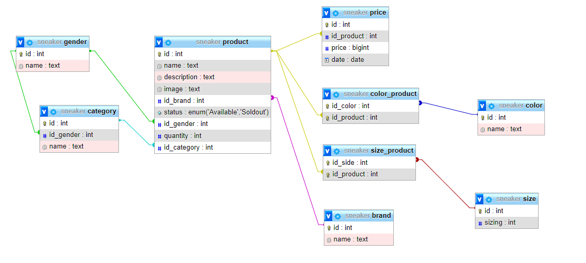
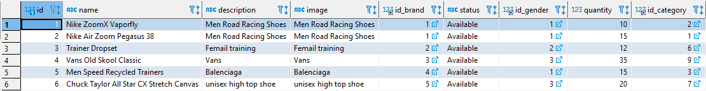

# Thêm dữ liệu vào database quản lý sản phẩm của shop bán giày

**Code:**

```sql
INSERT INTO brand (id, name) VALUES (NULL, 'NIKE');
INSERT INTO brand (id, name) VALUES (NULL, 'ADIDAS');
INSERT INTO brand (id, name) VALUES (NULL, 'VANS');
INSERT INTO brand (id, name) VALUES (NULL, 'BALENCIAGA');
INSERT INTO brand (id, name) VALUES (NULL, 'CONVERSE');

INSERT INTO gender (id, name) VALUES (NULL, 'MALE');
INSERT INTO gender (id, name) VALUES (NULL, 'FEMALE');
INSERT INTO gender (id, name) VALUES (NULL, 'UNISEX');

INSERT INTO category (id, id_gender, name) VALUES (NULL,1,'SPORT');
INSERT INTO category (id, id_gender, name) VALUES (NULL,1,'RUNNING');
INSERT INTO category (id, id_gender, name) VALUES (NULL,1,'TRAINING');
INSERT INTO category (id, id_gender, name) VALUES (NULL,2,'SPORT');
INSERT INTO category (id, id_gender, name) VALUES (NULL,2,'RUNNING');
INSERT INTO category (id, id_gender, name) VALUES (NULL,2,'TRAINING');
INSERT INTO category (id, id_gender, name) VALUES (NULL,3,'SPORT');
INSERT INTO category (id, id_gender, name) VALUES (NULL,3,'RUNNING');
INSERT INTO category (id, id_gender, name) VALUES (NULL,3,'TRANING');

INSERT INTO color (id, name) VALUES (NULL,'WHITE');
INSERT INTO color (id, name) VALUES (NULL,'BLACK');
INSERT INTO color (id, name) VALUES (NULL,'BLUE');
INSERT INTO color (id, name) VALUES (NULL,'GREEN');
INSERT INTO color (id, name) VALUES (NULL,'YELLOW');
INSERT INTO color (id, name) VALUES (NULL,'GRAY');
INSERT INTO color (id, name) VALUES (NULL,'ORANGE');
INSERT INTO color (id, name) VALUES (NULL,'VIOLET');
INSERT INTO color (id, name) VALUES (NULL,'RED');

INSERT INTO product (id, name,description,image,id_brand,status,id_gender,quantity,id_category) 
VALUES (NULL, 'Nike ZoomX Vaporfly','Men Road Racing Shoes','Men Road Racing Shoes',1,'Available',1,10,2);
INSERT INTO product (id, name,description,image,id_brand,status,id_gender,quantity,id_category) 
VALUES (NULL, 'Nike Air Zoom Pegasus 38','Men Road Racing Shoes','Men Road Racing Shoes',1,'Available',1,15,1);
INSERT INTO product (id, name,description,image,id_brand,status,id_gender,quantity,id_category) 
VALUES (NULL, 'Trainer Dropset','Femail training','Femail training',2,'Available',2,12,6);
INSERT INTO product (id, name,description,image,id_brand,status,id_gender,quantity,id_category) 
VALUES (NULL, 'Vans Old Skool Classic','Vans','Vans',3,'Available',3,35,9);
INSERT INTO product (id, name,description,image,id_brand,status,id_gender,quantity,id_category) 
VALUES (NULL, 'Men Speed Recycled Trainers','Balenciaga','Balenciaga',4,'Available',1,15,3);
INSERT INTO product (id, name,description,image,id_brand,status,id_gender,quantity,id_category) 
VALUES (NULL, 'Chuck Taylor All Star CX Stretch Canvas','unisex high top shoe','unisex high top shoe',5,'Available',3,20,7);

INSERT INTO color_product (id_color,id_product) VALUES (2,1);
INSERT INTO color_product (id_color,id_product) VALUES (1,2);
INSERT INTO color_product (id_color,id_product) VALUES (9,3);
INSERT INTO color_product (id_color,id_product) VALUES (3,4);
INSERT INTO color_product (id_color,id_product) VALUES (6,5);
INSERT INTO color_product (id_color,id_product) VALUES (1,6);

INSERT INTO price (id,id_product,price,`date`) VALUES (NULL ,1,3400000,'2022-02-19');
INSERT INTO price (id,id_product,price,`date`) VALUES (NULL ,2,2400000,'2022-02-19');
INSERT INTO price (id,id_product,price,`date`) VALUES (NULL ,3,3000000,'2022-02-19');
INSERT INTO price (id,id_product,price,`date`) VALUES (NULL ,4,1500000,'2022-02-19');
INSERT INTO price (id,id_product,price,`date`) VALUES (NULL ,5,25000000,'2022-02-19');
INSERT INTO price (id,id_product,price,`date`) VALUES (NULL ,6,1000000,'2022-02-19');

INSERT INTO size (id,sizing) VALUES (NULL,7);
INSERT INTO size (id,sizing) VALUES (NULL,8);
INSERT INTO size (id,sizing) VALUES (NULL,9);
INSERT INTO size (id,sizing) VALUES (NULL,10);
INSERT INTO size (id,sizing) VALUES (NULL,11);
INSERT INTO size (id,sizing) VALUES (NULL,12);

INSERT INTO size_product (id_side,id_product) VALUES (3,1);
INSERT INTO size_product (id_side,id_product) VALUES (2,2);
INSERT INTO size_product (id_side,id_product) VALUES (4,3);
INSERT INTO size_product (id_side,id_product) VALUES (3,4);
INSERT INTO size_product (id_side,id_product) VALUES (2,5);
INSERT INTO size_product (id_side,id_product) VALUES (3,6);
```



**Dài quá nên em chụp 1 cái điển hình thôi ạ**

**Data Product**
