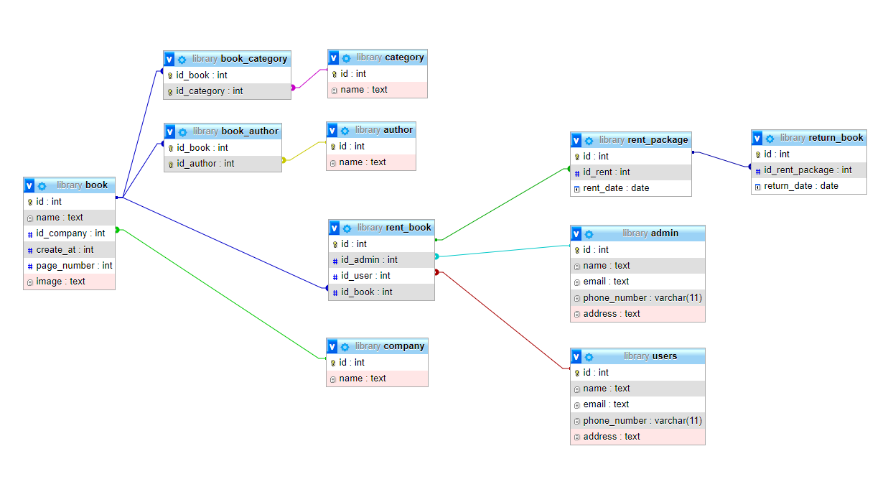

# Thiết kế database quản lý thư viện

**Tạo table:**
```sql
CREATE TABLE admin(
	id INT PRIMARY KEY AUTO_INCREMENT,
	name TEXT NOT NULL,
	email TEXT,
	phone_number VARCHAR(11) NOT NULL,
	address TEXT NOT NULL
)

CREATE TABLE users(
	id INT PRIMARY KEY AUTO_INCREMENT,
	name TEXT NOT NULL,
	email TEXT,
	phone_number VARCHAR(11) NOT NULL,
	address TEXT NOT NULL
)

CREATE TABLE company(
	id INT PRIMARY KEY AUTO_INCREMENT,
	name TEXT NOT NULL
)

CREATE TABLE category(
	id INT PRIMARY KEY AUTO_INCREMENT,
	name TEXT NOT NULL
)

CREATE TABLE author(
	id INT PRIMARY KEY AUTO_INCREMENT,
	name TEXT NOT NULL
)

CREATE TABLE book(
	id INT PRIMARY KEY AUTO_INCREMENT,
	name TEXT NOT NULL,
	id_company INT,
	create_at INT NOT NULL,
	page_number INT NOT NULL,
	image TEXT NOT NULL,
	FOREIGN KEY(id_company) REFERENCES company (id)
)

CREATE TABLE book_category(
	id_book INT,
	id_category INT,
	PRIMARY KEY (id_book,id_category),
	FOREIGN KEY (id_book) REFERENCES book (id),
	FOREIGN KEY (id_category) REFERENCES category (id)
)

CREATE TABLE book_author(
	id_book INT,
	id_author INT,
	PRIMARY KEY (id_book,id_author),
	FOREIGN KEY (id_book) REFERENCES book (id),
	FOREIGN KEY (id_author) REFERENCES author (id)
)

CREATE TABLE rent_book(
	id INT PRIMARY KEY AUTO_INCREMENT,
	id_admin INT,
	id_user INT,
	id_book INT,
	FOREIGN KEY (id_book) REFERENCES book (id),
	FOREIGN KEY (id_admin) REFERENCES admin (id),
	FOREIGN KEY (id_user) REFERENCES users (id)
)

CREATE TABLE rent_package(
	id INT PRIMARY KEY AUTO_INCREMENT,
	id_rent INT,
	rent_date DATE NOT NULL,
	FOREIGN KEY (id_rent) REFERENCES rent_book (id)
)

CREATE TABLE return_book(
	id INT PRIMARY KEY AUTO_INCREMENT,
	id_rent_package INT,
	return_date DATE NOT NULL,
	FOREIGN KEY (id_rent_package) REFERENCES rent_package (id)
)
```

**Tạo Data:**
```sql
INSERT INTO admin (id,name,email,phone_number,address) VALUES (NULL,'TUAN ANH','tuananhdang9x@gmail.com',0941757062,'HATECO Hoang Mai');

INSERT INTO users (id,name,email,phone_number,address) VALUES (NULL,'HOANG TRAN','hoangtran@gmail.com',0941757038,'Linh Dam');
INSERT INTO users (id,name,email,phone_number,address) VALUES (NULL,'THU HA','biha@gmail.com',0941757099,'Cau giay');

INSERT INTO author (id,name) VALUES (NULL,'Mark manson');
INSERT INTO author (id,name) VALUES (NULL,'Stephen R.Covey');

INSERT INTO company (id,name) VALUES (NULL,'Nha xuat ban van hoc');
INSERT INTO company (id,name) VALUES (NULL,'Nha xuat ban tong hop TP.HCM');

INSERT INTO book(id,name,id_company,create_at,page_number,image) VALUES (NULL,'Nghe thuat tinh te cua viec dech quan tam',1,2021,282,'The subtile art of not giving a f*ck');
INSERT INTO book(id,name,id_company,create_at,page_number,image) VALUES (NULL,'7 thoi quen hieu qua',2,2020,530,'7 Habits of highly effective people');

INSERT INTO book_author (id_book,id_author) VALUES (1,1);
INSERT INTO book_author (id_book,id_author) VALUES (2,2);

INSERT INTO category (id,name) VALUES (NULL,'Seft help');
INSERT INTO category (id,name) VALUES (NULL,'Drama');
INSERT INTO category (id,name) VALUES (NULL,'Novel');

INSERT INTO book_category  (id_book,id_category) VALUES (1,1);
INSERT INTO book_category  (id_book,id_category) VALUES (1,2);
INSERT INTO book_category  (id_book,id_category) VALUES (2,1);

INSERT INTO rent_book (id,id_admin,id_user,id_book) VALUES (NULL,1,1,1);
INSERT INTO rent_book (id,id_admin,id_user,id_book) VALUES (NULL,1,2,2);

INSERT INTO rent_package (id,id_rent,rent_date) VALUES (NULL,1,'2022-02-21');
INSERT INTO rent_package (id,id_rent,rent_date) VALUES (NULL,2,'2022-02-21');

INSERT INTO return_book (id,id_rent_package,return_date) VALUES (NULL,1,'2022-02-25');
INSERT INTO return_book (id,id_rent_package,return_date) VALUES (NULL,2,'2022-02-28');
```

**Sơ đồ:**

