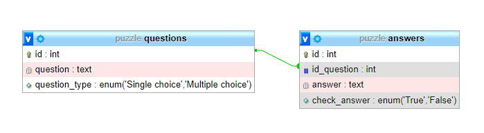

# Tạo database cho câu hỏi và đáp án.

*CODE:*
```sql
CREATE TABLE questions(
	id INT PRIMARY KEY AUTO_INCREMENT,
	question TEXT NOT NULL,
	question_type ENUM('Single choice','Multiple choice') NOT NULL 
)

CREATE TABLE answers(
	id INT PRIMARY KEY AUTO_INCREMENT,
	id_question INT,
	answer TEXT NOT NULL,
	check_answer ENUM('True','False'),
	FOREIGN KEY(id_question) REFERENCES questions (id)
)

INSERT INTO questions (id,question,question_type) VALUES (NULL,'1 plus 1 equals?','Single choice'),
(NULL,'2 multiple 6 equals?','Single choice'),
(NULL,'8 subtract 3 equals?','Single choice'),
(NULL,'9 divide 3 equals?','Single choice'),
(NULL,'4 multiple 5','Multiple choice')

INSERT INTO answers (id,id_question,answer,check_answer) VALUES (NULL,1,2,'True'),
(NULL,1,5,'False'),
(NULL,1,0,'False'),
(NULL,1,3,'False')

INSERT INTO answers (id,id_question,answer,check_answer) VALUES (NULL,2,5,'False'),
(NULL,2,7,'False'),
(NULL,2,12,'True'),
(NULL,2,3,'False')

INSERT INTO answers (id,id_question,answer,check_answer) VALUES (NULL,3,10,'False'),
(NULL,3,5,'True'),
(NULL,3,12,'False'),
(NULL,3,3,'False')

INSERT INTO answers (id,id_question,answer,check_answer) VALUES (NULL,4,10,'False'),
(NULL,4,3,'True'),
(NULL,4,12,'False'),
(NULL,4,3,'False')

INSERT INTO answers (id,id_question,answer,check_answer) VALUES (NULL,4,10,'False'),
(NULL,4,20,'True'),
(NULL,4,2*10,'True'),
(NULL,4,3,'False')
```

*Bảng:*
